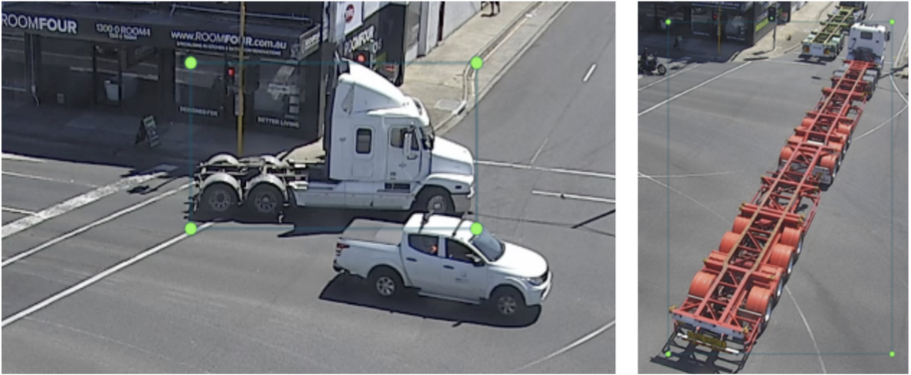
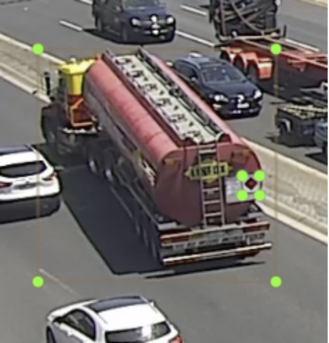
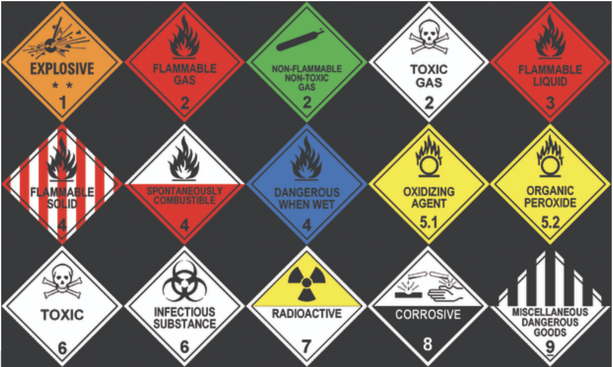

# VicRoads-Labelling
 
## Quick Start

1. Clone or download this repository
```
git clone https://github.com/ssswww4444/VicRoads-Labelling.git
```
2. Install the required modules:
    * Follow the installation instruction in: https://github.com/tzutalin/labelImg to get Python + Qt
    * And install **OpenCV** by running this in terminal:
        ```
        pip3 install opencv-python
        ```
3. Start capturing images and labelling them

---

## Trucks and Trailers Taxonomy:
* The classes are determined by the number of axles and the spacing between them
* Check: https://www.nhvr.gov.au/files/201707-0577-common-heavy-freight-vehicles-combinations.pdf

## Special Classes
1. Other: label the vehicle as “Other” if it’s a truck / trailer but doesn’t match with any class in the PDF provided above  

2. DGV: label the small DGV (Dangerous Goods Vehicles) signs  



---

## Capturing images (Two Options)

### Basic Operations
1. "Space" - Capture the current frame
2. "Esc" - Skip / exit the current video
3. Key "P" - Pause video
4. Key "D" - Skip 10 frames (useful when only a few vehicles are in the video)

### Option 1: Capture images from a specific video
1. Set the input, video, and output directory, video_name in `snapshot.py`:
    * For example, for video: `20191210-0733_CAM2_0073.MP4`:
        ```
        input_dir = "/Volumes/VERBATIM HD/5805_DOT_ArterialNetworkFootage/Site01-StanleyAve,MountWaverley/Camera01/C341/DCIM/101MEDIA"
        video_dir = "Site01-StanleyAve,MountWaverley"
        video_name = "20191210-0733_CAM2_0073.MP4"
        output_dir = "images/"
        ```
2. Run `snapshot.py` in terminal:
   ```
   python3 snapshot.py
   ```
3. This will play the specific video in `input_dir`, and save the images to `output_dir/video_dir/`

### Option 2: Capture images from all videos
1. Set the input, video, and output directory, video_name in `snapshot_playall.py`:
   * For example: 
        ```
        input_dir = "/Volumes/VERBATIM HD/5805_DOT_ArterialNetworkFootage/Site01-StanleyAve,MountWaverley/Camera01/C341/DCIM/101MEDIA"
        video_dir = "Site01-StanleyAve,MountWaverley"
        output_dir = "images/"
        ```
2. Run `snapshot_playall.py` in terminal:
   ```
   python3 snapshot_playall.py
   ```
3. This will play **all** the video in `input_dir`, and save the images to `output_dir/video_dir/`
4. Hint: You can specify a start point of the playlist
   * For example, to play the videos starting from `20191210-0203_CAM2_0040.MP4`, run: **(Sorted by video filenames in ascending order)**
   ```
   python3 snapshot_playall.py -s 20191210-0203_CAM2_0040.MP4
   ```
   ("-s" is the optional argument for a start point of playlist)  
5. Hint2: Press `Ctrl+C` in terminal if you want to exit all the videos (exit the program)
---

## Labelling images
1. Run the labelImg tool:
   ```
   cd labelImg
   python3 labelImg.py 
   ```
    

2. Open the directory where you save the captured images
3. Make sure save format is "PascalVOC" (default)
4. Start labelling by hitting "Create\nRectBox"  
   (Shortcuts: "W" for creating bounding box, "A" and "D" for prev/next image)
5. The annotation files (.xml format) will be save in the same directory as you store the original images

---

## Additional Notes
1. The dataset has approximately 144 hours of video
2. About 30-40% of them are totally dark, just ignore those videos, don't capture/label them
3. Only capture/label the frames when you can clearly identify the truck and trailer class
4. Please contact me if you have any questions (peiyuns@student.unimelb.edu.au)
5. Pei-Yun: I'll begin with Site02 and Site03.