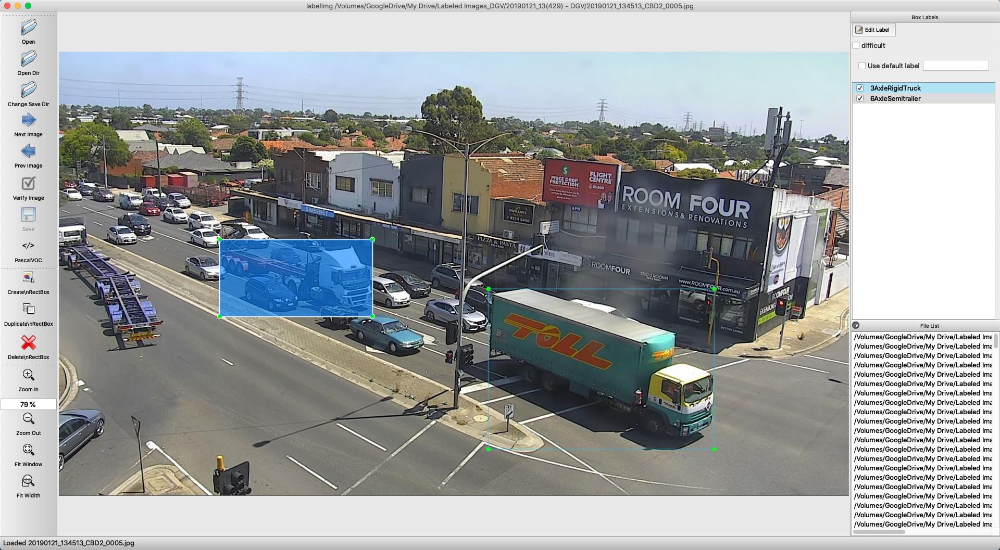

# VicRoads-Labelling
 
## Quick Start

1. Clone or download this repository
```
git clone https://github.com/ssswww4444/VicRoads-Labelling.git
```
2. Install the required modules:
    * Follow the installation instruction in: https://github.com/tzutalin/labelImg to get Python + Qt
    * And install **OpenCV** by running this in terminal:
        ```
        pip3 install opencv-python
        ```
3. Start capturing images and labelling them

## Capturing images
1. Set the input and output directory in `snapshot.py`:
    * For example:
        ```
        input_dir = "/Volumes/VERBATIM HD/5805_DOT_ArterialNetworkFootage/Site01-StanleyAve,MountWaverley/Camera01/C341/DCIM/101MEDIA"
        video_dir = "Site01-StanleyAve,MountWaverley"
        output_dir = "images/"
        ```
2. Run `snapshot.py` in terminal:
   ```
   python3 snapshot.py
   ```
3. This will play all the videos in the input directory, and save the images to `output_dir/video_dir/`
4. Hit "Enter" to capture the frames where trucks and trailers appears  
   (Only need to capture 1-2 frames for each truck and trailer)
5. Hit "Esc" to exit / skip the current video

## Labelling images
1. Run the labelImg tool:
   ```
   cd labelImg
   python3 labelImg.py 
   ```
    

2. Open the directory where you save the captured images
3. Make sure save format is "PascalVOC" (default)
4. Start labelling by hitting "Create\nRectBox"  
   (Shortcuts: "W" for creating bounding box, "A" and "D" for prev/next image)
5. The annotation files (.xml format) will be save in the same directory as you store the original images